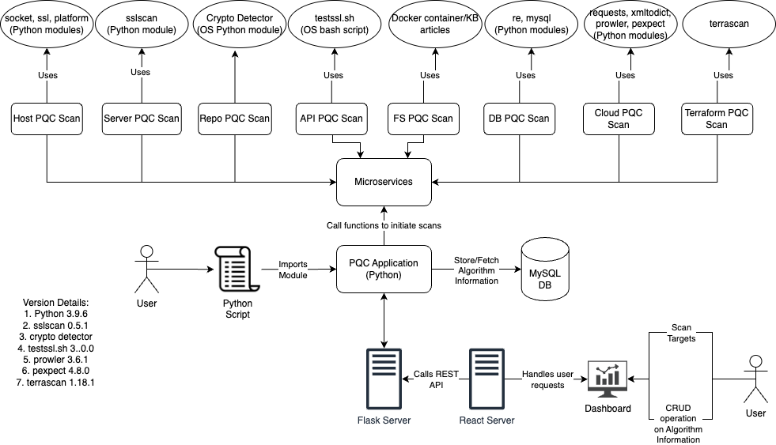
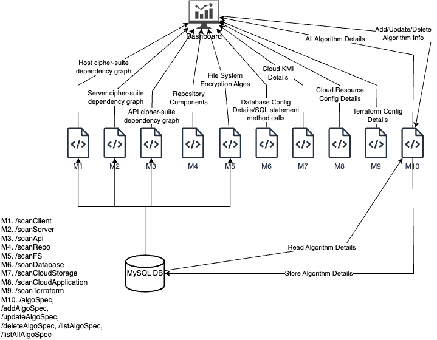

# Quartz

Quartz stands for Quantum Risk and Threat Analyzer. The Quartz system scans remote targets and scan their cryptographic configurations to validate readiness of the system against post-quantum cryptographic recommendations.

## Architecture

The prototype has been designed to be capable of being used as a library and as a web application. The main logic of the application, written primarily using python, runs behind a Flask server as microservices. Each scanner has been independently implemented and is accessible as its own microservice. The web application is accessible using a dashboard deployed on a React server.

Interactions between the servers and to the back-end microservices are encoded as standardized JSON structures. The React server initiates scans by sending requests to the Flask server and depicts the scan results received from it.

The results of the scans are cross-referenced against cipher suites and algorithm information stored in a MySQL database. The analysis is performed to identify the post-quantum security status of the protocols.



### Microservice Details



1. The **host scanner** module uses native SSL module to gauge the cipher suite support on the host. It performs two checks: one to determine all suites supported by the system and another to determine the cipher suites shared during connection setup. System support for cipher suites is determined using the native OpenSSL tool.
2. The **server scanner** module uses the sslscan module to scan remote servers and return list of cipher suites chosen by the server while setting up the connection.
3. The **API scanner** uses the testssl.sh open-source bash script to scan remote APIs servers.
4. The **repository scanner** uses a python-based open-source tool, Crypto Detector, developed by Wind River to scan remote repositories. It returns a list of components and their security status.
5. The **database scanner** connects with database instances using service accounts to check for configuration details and identify post-quantum secure status.
6. The **cloud scanner** uses open API calls to the cloud buckets as per the knowledge base of the service provider.
7. The **file system** scanner uses Docker module to deploy live instances and read supported encryption standards from it.
8. The **terraform and config file scanners** use Terrascan to scan for configuration details in configuration files like Terraform, Dockerfile, etc.
9. The **cloud application scanner** uses Prowler tool to scan for deployed resources in a cloud account and determine each resource's cryptographic configuration details.

## Installation Steps

### Cloning the repository

Before running the dashboard, we need to fetch all the required code to our system. To clone the Git repository to the local system,

```
git clone <Quartz github URL>
```

### Setting up the Database

Before launching the dashboard, ensure that you add the database credentials in the`quartz-dashboard/.env` and `flask-app/pqc.config.json` files.

#### Updating quartz-dashboard/.env File

In the `quartz-dashboard/.env` file, configure the following MySQL environment variables:

- `MYSQL_ROOT_PASSWORD`: (Required) Set the root password for MySQL.
- `MYSQL_DATABASE`: (Required) Specify the desired MySQL database name.
- `MYSQL_USER`: (Required) Define the MySQL user for the application.
- `MYSQL_PASSWORD`: (Required) Set the password for the MySQL user.

#### Example: quartz-dashboard/.env

```
MYSQL_ROOT_PASSWORD = rootpassword
MYSQL_DATABASE = localhost
MYSQL_USER = testuser
MYSQL_PASSWORD = 12345678
```

#### Updating flask-app/pqc.config.json File

In the `flask-app/pqc.config.json` file, configure the following parameters:

- `ACCESS_TOKEN`: (Required) Specify the GitHub access token for authentication. Choose between a GitHub classic token or a fine-grained token.
- `DB_HOST`: (Required) Refer to the `docker-compose.yml` file to find the hostname of the MySQL service.
- `DB_DATABASE`: (Required) Set this parameter to the value specified in `quartz-dashboard/.env` for `MYSQL_DATABASE` to ensure proper configuration.
- `DB_USER`: (Required) Set this parameter to the value specified in `quartz-dashboard/.env` for `MYSQL_USER` to ensure proper configuration.
- `DB_PASSWORD`: (Required) Set this Parameter to the value specified in `quartz-dashboard/.env` for `MYSQL_PASSWORD` to ensure proper configuration.
- `SECRET_KEY`: (Optional) Define the secret key for secure data encryption.
- `RANDOM_KEY`: (Optional) Set a random key for additional security measures.
- `SERVICE_USER`: (Required) Specify the type of user for the service.
- `SERVICE_PASSWORD`: (Required) Set this Parameter to the value specified in `quartz-dashboard/.env` for `MYSQL_ROOT_PASSWORD` to ensure proper configuration.

#### Example: flask-app/pqc.config.json

```
{
    "ACCESS_TOKEN": "github token",
    "DB_HOST":  "docker-compose-mysql",
    "DB_DATABASE":  "localhost",
    "DB_USER": "testuser",
    "DB_PASSWORD": "12345678",
    "SECRET_KEY": "secret_key",
    "RANDOM_KEY": "random_key",
    "SERVICE_USER":"root",
    "SERVICE_PASSWORD":"rootpassword"
}
```

### How to install Docker

If you do not have Docker, please follow the instructions on the [Docker](https://www.docker.com) website to install it in your environment.

### Port Configuration

If you are using macOS, please make sure that port 5000 is available for your Flask app. By default, Flask development servers run on port 5000. If you encounter any connection issues between the React and Flask applications, follow these steps:

```
- Check Port Availability: `sudo lsof -i :<portnumber>`
- Disconnect Port: If the port is in use and you need to disconnect it, you can kill the process by using `sudo kill <PID>`
```

### Launching the Dashboard

The dashboard is currently running on docker, so we need to build the container and deploy it.

```
cd Quartz/quartz-dashboard
docker-compose build
docker-compose up
```

### Accessing the application

Navigate to http://localhost:3000 to access the dashboard.

### Terminating the Dashboard

To stop the dashboard containers, type CTRL+C to stop the running instance. Then, we can stop the containers by using the below command:

```
docker-compose down
```

## Documentation

The documentation is uploaded within the "/docs" directory.

## Links to Community Resources

1. Crypto-Detector: https://github.com/Wind-River/crypto-detector.git
2. TestSSL: https://github.com/drwetter/testssl.sh.git
3. SSLScan: https://github.com/rbsec/sslscan.git
4. Terrascan: https://github.com/tenable/terrascan.git
5. Prowler: https://github.com/prowler-cloud/prowler.git

## Contributing

To learn how to contribute to this project, read the [Contribution Guidelines](./CONTRIBUTING.md).

## License

[LICENSE](./LICENSE)
